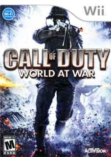
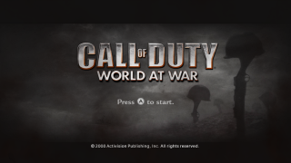
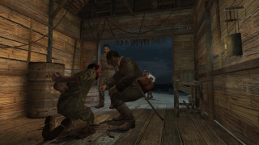

# Design Doc for [Call of Duty: World at War](https://retroachievements.org/game/34831)
## Table of Contents
1. [Assets](#assets)
2. [About](#about)
3. [Code Notes](#code-notes)
4. [Achievements](#achievements)
5. [Leaderboards](#leaderboards)
## Assets
<sub>[Back to Table of Contents](#table-of-contents)</sub>
### Assets Navigation
1. [Game Icon](#game-icon)
2. [Box Art](#box-art)
3. [Title Screen](#title-screen)
4. [In-Game](#in-game)
### [Game Icon](https://media.retroachievements.org/Images/000001.png)
<sub>[Back to navigation](#assets-navigation)</sub><br>
<br><br>
### [Box Art](https://media.retroachievements.org/Images/118918.png)
<sub>[Back to navigation](#assets-navigation)</sub><br>
<br><br>
### [Title Screen](https://media.retroachievements.org/Images/118916.png)
<sub>[Back to navigation](#assets-navigation)</sub><br>
<br><br>
### [In-Game](https://media.retroachievements.org/Images/118917.png)
<sub>[Back to navigation](#assets-navigation)</sub><br>
<br><br>
## About
<sub>[Back to Table of Contents](#table-of-contents)</sub>
- [Game Page](https://retroachievements.org/game/34831)
- [Forum Topic](https://retroachievements.org/forums/topic/32460)
## Code Notes
<sub>[Back to Table of Contents](#table-of-contents)</sub>
### Code Notes Navigation
1. [Code Note 0x000000](#code-note-0x000000)
2. [Code Note 0x6969e4](#code-note-0x6969e4)
3. [Code Note 0x6969e8](#code-note-0x6969e8)
4. [Code Note 0x6969ec](#code-note-0x6969ec)
5. [Code Note 0x6d308e](#code-note-0x6d308e)
6. [Code Note 0x6f1560](#code-note-0x6f1560)
7. [Code Note 0x6f26f0](#code-note-0x6f26f0)
8. [Code Note 0x7238d8](#code-note-0x7238d8)
9. [Code Note 0x727cbe](#code-note-0x727cbe)
10. [Code Note 0x727ce0](#code-note-0x727ce0)
11. [Code Note 0x727ce4](#code-note-0x727ce4)
12. [Code Note 0x727cee](#code-note-0x727cee)
13. [Code Note 0x727d10](#code-note-0x727d10)
14. [Code Note 0x727d20](#code-note-0x727d20)
15. [Code Note 0x727d28](#code-note-0x727d28)
16. [Code Note 0x727d38](#code-note-0x727d38)
17. [Code Note 0x727d3a](#code-note-0x727d3a)
18. [Code Note 0x727d3c](#code-note-0x727d3c)
19. [Code Note 0x727d3e](#code-note-0x727d3e)
20. [Code Note 0x727d44](#code-note-0x727d44)
21. [Code Note 0x727d48](#code-note-0x727d48)
22. [Code Note 0x727d4c](#code-note-0x727d4c)
23. [Code Note 0x727de0](#code-note-0x727de0)
24. [Code Note 0x727de2](#code-note-0x727de2)
25. [Code Note 0x727de4](#code-note-0x727de4)
26. [Code Note 0x727de6](#code-note-0x727de6)
27. [Code Note 0x727dec](#code-note-0x727dec)
28. [Code Note 0x727dee](#code-note-0x727dee)
29. [Code Note 0x727df0](#code-note-0x727df0)
30. [Code Note 0x727df2](#code-note-0x727df2)
31. [Code Note 0x727df8](#code-note-0x727df8)
32. [Code Note 0x727dfa](#code-note-0x727dfa)
33. [Code Note 0x727e5c](#code-note-0x727e5c)
34. [Code Note 0x727e5d](#code-note-0x727e5d)
35. [Code Note 0x727e5e](#code-note-0x727e5e)
36. [Code Note 0x727e5f](#code-note-0x727e5f)
37. [Code Note 0x729b6c](#code-note-0x729b6c)
38. [Code Note 0x77032a](#code-note-0x77032a)
39. [Code Note 0x7aa8a0](#code-note-0x7aa8a0)
40. [Code Note 0x844340](#code-note-0x844340)
41. [Code Note 0x8691a0](#code-note-0x8691a0)
42. [Code Note 0x99af62](#code-note-0x99af62)
43. [Code Note 0xa621a0](#code-note-0xa621a0)
44. [Code Note 0x1452056](#code-note-0x1452056)
45. [Code Note 0x15120ec](#code-note-0x15120ec)
46. [Code Note 0x1691ae4](#code-note-0x1691ae4)
### Code Note 0x000000
<sub>[Back to navigation](#code-notes-navigation)</sub><br>
<br>Author: [joshraphael](https://retroachievements.org/user/joshraphael)<br>
```txt
RAScript: https://github.com/joshraphael/ra34831/blob/main/34831.rascript
```
### Code Note 0x6969e4
<sub>[Back to navigation](#code-notes-navigation)</sub><br>
<br>Author: [joshraphael](https://retroachievements.org/user/joshraphael)<br>
```txt
[Float BE] Map Coordinate X
```
### Code Note 0x6969e8
<sub>[Back to navigation](#code-notes-navigation)</sub><br>
<br>Author: [joshraphael](https://retroachievements.org/user/joshraphael)<br>
```txt
[Float BE] Map Coordinate Y
```
### Code Note 0x6969ec
<sub>[Back to navigation](#code-notes-navigation)</sub><br>
<br>Author: [joshraphael](https://retroachievements.org/user/joshraphael)<br>
```txt
[Float BE] Map Coordinate Z
```
### Code Note 0x6d308e
<sub>[Back to navigation](#code-notes-navigation)</sub><br>
<br>Author: [joshraphael](https://retroachievements.org/user/joshraphael)<br>
```txt
[16-bit BE] Iron Sight

0x0000 = No Scope
0x0001 = Scoped
```
### Code Note 0x6f1560
<sub>[Back to navigation](#code-notes-navigation)</sub><br>
<br>Author: [joshraphael](https://retroachievements.org/user/joshraphael)<br>
```txt
[ASCII Text] Map Name (unstable?)

ui = Not in mission (Main Menu)
mak = Semper Fi
pel1 = Little Resistance
pel2a = Hard Landing (Part 1)
pel2b_load = In-Between Part 1and Part 2
pel2b = Hard Landing (Part 2)
sniper = Vendetta
see1 = Their Land, Their Blood
pel1a = Burn 'em Out
pel1b = Relentless
see2 = Blood & Iron
ber1 = Ring of Steel
ber2 = Eviction
oki2 = Blowtorch & Corkscrew
oki3 = Breaking Point
oki3_load = Loading
ber3 = Heart of the Riech
ber3b = Downfall
```
### Code Note 0x6f26f0
<sub>[Back to navigation](#code-notes-navigation)</sub><br>
<br>Author: [joshraphael](https://retroachievements.org/user/joshraphael)<br>
```txt
[ASCII Text] Map Name (Better than 0x6f1560)

ui = Not in mission (Main Menu)
mak = Semper Fi
pel1 = Little Resistance
pel2a = Hard Landing (Part 1)
pel2b_load = In-Between Part 1and Part 2
pel2b = Hard Landing (Part 2)
sniper = Vendetta
see1 = Their Land, Their Blood
pel1a = Burn 'em Out
pel1b = Relentless
see2 = Blood & Iron
ber1 = Ring of Steel
ber2 = Eviction
oki2 = Blowtorch & Corkscrew
oki3 = Breaking Point
oki3_load = Loading
ber3 = Heart of the Riech
ber3b = Downfall
```
### Code Note 0x7238d8
<sub>[Back to navigation](#code-notes-navigation)</sub><br>
<br>Author: [joshraphael](https://retroachievements.org/user/joshraphael)<br>
```txt
[32-bit BE] Mission Timer
```
### Code Note 0x727cbe
<sub>[Back to navigation](#code-notes-navigation)</sub><br>
<br>Author: [joshraphael](https://retroachievements.org/user/joshraphael)<br>
```txt
[16-bit BE] Current Weapon

--- Mission 1
0x0000 = None
0x0001 = Default Weapon (Hands)
0x0002 = N/A
0x0003 = N/A
0x0004 = Type 100
0x0005 = Arisaka
0x0006 = M1 Garand
0x0007 = Thompson
0x0008 = Scoped Arisaka
0x0009 = Arisaka Bayonet
0x000b = M1897 Trench Gun
0x000c = Colt M1911
0x000e = Nambu Pistol
0x000d = Scoped Springfield
0x0010 = BAR

--- Mission 2
0x000b = Deployable Type 99
0x000c = M1897 Trench Gun
0x000e = Arisaka
0x000f = Type 100
0x0010 = Ray Gun
0x0012 = Colt M1911
0x0014 = M1 Garand
0x0018 = Arisaka Bayonet
0x0019 = Scoped Arisaka
0x001d = M1 Garand Bayonet
0x001f = Air Strike
```
### Code Note 0x727ce0
<sub>[Back to navigation](#code-notes-navigation)</sub><br>
<br>Author: [joshraphael](https://retroachievements.org/user/joshraphael)<br>
```txt
[Float BE] Crosshair Y
```
### Code Note 0x727ce4
<sub>[Back to navigation](#code-notes-navigation)</sub><br>
<br>Author: [joshraphael](https://retroachievements.org/user/joshraphael)<br>
```txt
[Float BE] Crosshair X
```
### Code Note 0x727cee
<sub>[Back to navigation](#code-notes-navigation)</sub><br>
<br>Author: [joshraphael](https://retroachievements.org/user/joshraphael)<br>
```txt
[16-bit BE] Stance

0x0008 = Dead?
0x000b = Prone
0x0028 = Crouch
0x003c = Stand
```
### Code Note 0x727d10
<sub>[Back to navigation](#code-notes-navigation)</sub><br>
<br>Author: [joshraphael](https://retroachievements.org/user/joshraphael)<br>
```txt
[32-bit BE] Enemy Bullets Hit Player

this is how many times a bullet has hit you
```
### Code Note 0x727d20
<sub>[Back to navigation](#code-notes-navigation)</sub><br>
<br>Author: [joshraphael](https://retroachievements.org/user/joshraphael)<br>
```txt
[32-bit BE] Health

0x00000000 = None
0x00000064 = Full
0xffffffca = Dead
```
### Code Note 0x727d28
<sub>[Back to navigation](#code-notes-navigation)</sub><br>
<br>Author: [joshraphael](https://retroachievements.org/user/joshraphael)<br>
```txt
[32-bit BE] Max Health
```
### Code Note 0x727d38
<sub>[Back to navigation](#code-notes-navigation)</sub><br>
<br>Author: [joshraphael](https://retroachievements.org/user/joshraphael)<br>
```txt
[16-bit BE] Ammo Types

--- Mission 1
Type-100 Ammo

---- Mission 2
Deployable Type 99
```
### Code Note 0x727d3a
<sub>[Back to navigation](#code-notes-navigation)</sub><br>
<br>Author: [joshraphael](https://retroachievements.org/user/joshraphael)<br>
```txt
[16-bit BE] Arisaka Rifle Ammo (All variants)
```
### Code Note 0x727d3c
<sub>[Back to navigation](#code-notes-navigation)</sub><br>
<br>Author: [joshraphael](https://retroachievements.org/user/joshraphael)<br>
```txt
[16-bit BE] Ammo

--- Mission 1
M1 Garand Rifle Ammo

--- Mission 2
Arisaka
```
### Code Note 0x727d3e
<sub>[Back to navigation](#code-notes-navigation)</sub><br>
<br>Author: [joshraphael](https://retroachievements.org/user/joshraphael)<br>
```txt
[16-bit BE] Ammo

--- Mission 1
Thompson Rifle Ammo

--- Mission 2
Type 100 Ammo
```
### Code Note 0x727d44
<sub>[Back to navigation](#code-notes-navigation)</sub><br>
<br>Author: [joshraphael](https://retroachievements.org/user/joshraphael)<br>
```txt
[16-bit] Colt Pistol Ammo
```
### Code Note 0x727d48
<sub>[Back to navigation](#code-notes-navigation)</sub><br>
<br>Author: [joshraphael](https://retroachievements.org/user/joshraphael)<br>
```txt
[16-bit BE] Ammo

--- Mission 1
Nambu Pistol Ammo

--- Mission 2
M1 Garand Bayonet Ammo
```
### Code Note 0x727d4c
<sub>[Back to navigation](#code-notes-navigation)</sub><br>
<br>Author: [joshraphael](https://retroachievements.org/user/joshraphael)<br>
```txt
[16-bit BE] BAR Rifle Ammo
```
### Code Note 0x727de0
<sub>[Back to navigation](#code-notes-navigation)</sub><br>
<br>Author: [joshraphael](https://retroachievements.org/user/joshraphael)<br>
```txt
[16-bit BE] Clip Ammo 1

--- Mission 1
Type 100
```
### Code Note 0x727de2
<sub>[Back to navigation](#code-notes-navigation)</sub><br>
<br>Author: [joshraphael](https://retroachievements.org/user/joshraphael)<br>
```txt
[16-bit BE] Clip Ammo 2

--- Mission 1
Arisaka
```
### Code Note 0x727de4
<sub>[Back to navigation](#code-notes-navigation)</sub><br>
<br>Author: [joshraphael](https://retroachievements.org/user/joshraphael)<br>
```txt
[16-bit BE] Clip Ammo 3

--- Mission 1
M1 Garand
```
### Code Note 0x727de6
<sub>[Back to navigation](#code-notes-navigation)</sub><br>
<br>Author: [joshraphael](https://retroachievements.org/user/joshraphael)<br>
```txt
[16-bit BE] Clip Ammo 4

--- Mission 2
Type 100
```
### Code Note 0x727dec
<sub>[Back to navigation](#code-notes-navigation)</sub><br>
<br>Author: [joshraphael](https://retroachievements.org/user/joshraphael)<br>
```txt
[16-bit] Mission 2 Secondary Weapon Bullets in Clip
```
### Code Note 0x727dee
<sub>[Back to navigation](#code-notes-navigation)</sub><br>
<br>Author: [joshraphael](https://retroachievements.org/user/joshraphael)<br>
```txt
[16-bit BE] Ammo Count

--- Mission 2
Number of Explosive Grenades
```
### Code Note 0x727df0
<sub>[Back to navigation](#code-notes-navigation)</sub><br>
<br>Author: [joshraphael](https://retroachievements.org/user/joshraphael)<br>
```txt
[16-bit BE] Clip Ammo 9

--- Mission 1
Number Of Primary Grenades

--- Mission 2
M1 Garand Bayonet
```
### Code Note 0x727df2
<sub>[Back to navigation](#code-notes-navigation)</sub><br>
<br>Author: [joshraphael](https://retroachievements.org/user/joshraphael)<br>
```txt
[16-bit BE] Clip Ammo 10

--- Mission 1
Nambu
```
### Code Note 0x727df8
<sub>[Back to navigation](#code-notes-navigation)</sub><br>
<br>Author: [joshraphael](https://retroachievements.org/user/joshraphael)<br>
```txt
[16-bit BE] Ammo Count

--- Mission 2
Number of Smoke Grenades
```
### Code Note 0x727dfa
<sub>[Back to navigation](#code-notes-navigation)</sub><br>
<br>Author: [joshraphael](https://retroachievements.org/user/joshraphael)<br>
```txt
[16-bit BE] Ammo

--- Mission 2
Air Strikes
```
### Code Note 0x727e5c
<sub>[Back to navigation](#code-notes-navigation)</sub><br>
<br>Author: [joshraphael](https://retroachievements.org/user/joshraphael)<br>
```txt
[8-bit] Weapon Bitflag 1

Weapons in your inventory you can cycle through

--- Mission 1
Bit 0 = N/A
Bit 1 = N/A
Bit 2 = N/A
Bit 3 = N/A
Bit 4 = N/A
Bit 5 = N/A
Bit 6 = N/A
Bit 7 = N/A

--- Mission 2
Bit 0 = Arisaka Bayonet
Bit 1 = Scoped Arisaka
Bit 2 = Type 100
Bit 3 = N/A
Bit 4 = N/A
Bit 5 = M1 Garand Bayonet
Bit 6 = Smoke Grenade
Bit 7 = Air Strike
```
### Code Note 0x727e5d
<sub>[Back to navigation](#code-notes-navigation)</sub><br>
<br>Author: [joshraphael](https://retroachievements.org/user/joshraphael)<br>
```txt
[8-bit] Weapon Bitflag 2

Weapons in your inventory you can cycle through

--- Mission 1
Bit 0 = BAR
Bit 1 = N/A
Bit 2 = N/A
Bit 3 = N/A
Bit 4 = N/A
Bit 5 = N/A
Bit 6 = N/A
Bit 7 = N/A

--- Mission 2
Bit 0 = Ray Gun
Bit 1 = Thompson
Bit 2 = Colt M1911
Bit 3 = Grenade (needs checking)
Bit 4 = M1 Garand
Bit 5 = M2 Flamethrower
Bit 6 = Nambu
Bit 7 = Grenade (needs checking)
```
### Code Note 0x727e5e
<sub>[Back to navigation](#code-notes-navigation)</sub><br>
<br>Author: [joshraphael](https://retroachievements.org/user/joshraphael)<br>
```txt
[8-bit] Weapon Bitflag 3

Weapons in your inventory you can cycle through

--- Mission 1
Bit 0 = Scoped Arisaka
Bit 1 = Arisaka Bayonet
Bit 2 = Grenades
Bit 3 = M1897 Trench Gun
Bit 4 = Colt M1911
Bit 5 = Grenades (need to determine if primary or secondary?)
Bit 6 = Nambu
Bit 7 = Scoped Springfield

--- Mission 2
Bit 0 = N/A
Bit 1 = N/A
Bit 2 = N/A
Bit 3 = Deployable Type 99
Bit 4 = M1897 Trench Gun
Bit 5 = N/A
Bit 6 = Arisaka
Bit 7 = Type 100
```
### Code Note 0x727e5f
<sub>[Back to navigation](#code-notes-navigation)</sub><br>
<br>Author: [joshraphael](https://retroachievements.org/user/joshraphael)<br>
```txt
[8-bit] Weapon Bitflag 4

Weapons in your inventory you can cycle through

--- Mission 1
Bit 0 = N/A
Bit 1 = Default Weapon (Hands)
Bit 2 = N/A
Bit 3 = N/A
Bit 4 = Type 100
Bit 5 = Arisaka
Bit 6 = M1 Garand
Bit 7 = Thompson

--- Mission 2
Bit 0 = Default Weapon (Hands)
Bit 1 = N/A
Bit 2 = Mounted Gun
Bit 3 = Mounted Gun
Bit 4 = N/A
Bit 5 = N/A
Bit 6 = N/A
Bit 7 = N/A
```
### Code Note 0x729b6c
<sub>[Back to navigation](#code-notes-navigation)</sub><br>
<br>Author: [joshraphael](https://retroachievements.org/user/joshraphael)<br>
```txt
[32-bit BE] Kill Count
```
### Code Note 0x77032a
<sub>[Back to navigation](#code-notes-navigation)</sub><br>
<br>Author: [joshraphael](https://retroachievements.org/user/joshraphael)<br>
```txt
[16-bit BE] Difficulty

0x0000 = Recruit
0x0001 = Normal
0x0002 = Hard
0x0003 = Veteran
```
### Code Note 0x7aa8a0
<sub>[Back to navigation](#code-notes-navigation)</sub><br>
<br>Author: [joshraphael](https://retroachievements.org/user/joshraphael)<br>
```txt
[32-bit BE] Event Flag?

--- Mission 2
0x00000000 = Radio Destroyed
0x00000001 = Radio Not Destroyed
```
### Code Note 0x844340
<sub>[Back to navigation](#code-notes-navigation)</sub><br>
<br>Author: [joshraphael](https://retroachievements.org/user/joshraphael)<br>
```txt
[32-bit BE] Event Flag: Saved Pvt. Ryan

0x00000000 = Died
0x00000001 = Saved
```
### Code Note 0x8691a0
<sub>[Back to navigation](#code-notes-navigation)</sub><br>
<br>Author: [joshraphael](https://retroachievements.org/user/joshraphael)<br>
```txt
[ASCII Text] Checkpoints

--- Mission 1 (Semper Fi)
$default
levelshots/autosave/autosave_makstart
levelshots / autosave / autosave_mak1
levelshots / autosave / autosave_mak2
levelshots / autosave / autosave_mak3
levelshots / autosave / autosave_mak4
levelshots / autosave / autosave_mak5
levelshots / autosave / autosave_mak6
levelshots / autosave / autosave_mak7
levelshots / autosave / autosave_mak8
levelshots / autosave / autosave_mak9
levelshots / autosave / autosave_mak10
levelshots / autosave / autosave_makend

--- Mission 2 (Little Resistance)
levelshots/autosave/autosave_pel1start
levelshots / autosave / autosave_pel11
levelshots / autosave / autosave_pel12
levelshots / autosave / autosave_pel13
levelshots / autosave / autosave_pel14
levelshots / autosave / autosave_pel15
levelshots / autosave / autosave_pel16
levelshots / autosave / autosave_pel17
levelshots / autosave / autosave_pel18
levelshots / autosave / autosave_pel1end

--- Mission 3 (Hard Landing Part 1)
levelshots/autosave/autosave_pel2astart
levelshots / autosave / autosave_pel2a1
levelshots / autosave / autosave_pel2a2
levelshots / autosave / autosave_pel2a3
levelshots / autosave / autosave_pel2a4
levelshots / autosave / autosave_pel2a5
levelshots / autosave / autosave_pel2a6
levelshots / autosave / autosave_pel2a7
levelshots / autosave / autosave_pel2a8
levelshots / autosave / autosave_pel2aend

--- Mission 3 (Hard Landing Part 2)
levelshots/autosave/autosave_pel2bstart
levelshots / autosave / autosave_pel2b1
levelshots / autosave / autosave_pel2b2
levelshots / autosave / autosave_pel2b3
levelshots / autosave / autosave_pel2b4
levelshots / autosave / autosave_pel2b5
levelshots / autosave / autosave_pel2b6
levelshots / autosave / autosave_pel2b7
levelshots / autosave / autosave_pel2b8
levelshots / autosave / autosave_pel2b9
levelshots / autosave / autosave_pel2b10
levelshots / autosave / autosave_pel2b11
levelshots / autosave / autosave_pel2b12
levelshots / autosave / autosave_pel2bend

--- Mission 4 (Vendetta)
levelshots/autosave/autosave_sniperstart
levelshots / autosave / autosave_sniper1
levelshots / autosave / autosave_sniper2
levelshots/autosave/autosave_sniper0

-- Mission 12 (Breaking Point)
levelshots/autosave/autosave_oki3start
levelshots / autosave / autosave_oki31
levelshots / autosave / autosave_oki32
levelshots / autosave / autosave_oki33
levelshots/autosave/autosave_oki30
levelshots / autosave / autosave_oki34
levelshots / autosave / autosave_oki35
levelshots / autosave / autosave_oki36
levelshots/autosave/autosave_oki30
levelshots / autosave / autosave_oki37
levelshots/autosave/autosave_oki30
levelshots / autosave / autosave_oki38
levelshots / autosave / autosave_oki39
levelshots / autosave / autosave_oki3end

--- Mission 13 ()
```
### Code Note 0x99af62
<sub>[Back to navigation](#code-notes-navigation)</sub><br>
<br>Author: [joshraphael](https://retroachievements.org/user/joshraphael)<br>
```txt
[16-bit BE] Event Flag

--- Ring of Steel
0x0000 = Did not hear laughs
0x0001 = Laugh's playing
0x0002 = Heard Laughs in Asylum
```
### Code Note 0xa621a0
<sub>[Back to navigation](#code-notes-navigation)</sub><br>
<br>Author: [joshraphael](https://retroachievements.org/user/joshraphael)<br>
```txt
[32-bit BE] Vendetta, Soldier Lift Head

0x00000000 = false
0x00000001 = true
```
### Code Note 0x1452056
<sub>[Back to navigation](#code-notes-navigation)</sub><br>
<br>Author: [joshraphael](https://retroachievements.org/user/joshraphael)<br>
```txt
[16-bit BE] Death Counter (Mission 1?)
```
### Code Note 0x15120ec
<sub>[Back to navigation](#code-notes-navigation)</sub><br>
<br>Author: [joshraphael](https://retroachievements.org/user/joshraphael)<br>
```txt
[32-bit BE] Unlock Missions?

0x00000000 = None unlocked
0x01000000 = Unlock all
```
### Code Note 0x1691ae4
<sub>[Back to navigation](#code-notes-navigation)</sub><br>
<br>Author: [joshraphael](https://retroachievements.org/user/joshraphael)<br>
```txt
[32-bit BE] Mission Timer
```
## Achievements
<sub>[Back to Table of Contents](#table-of-contents)</sub>
### Achievements Navigation
## Leaderboards
<sub>[Back to Table of Contents](#table-of-contents)</sub>
### Leaderboards Navigation